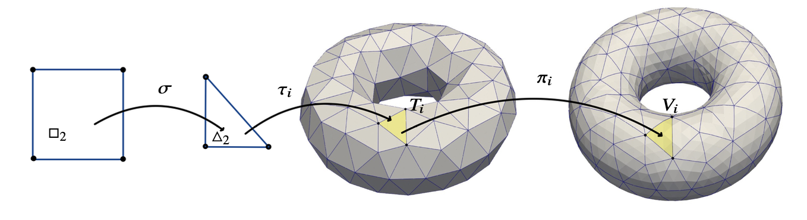

[](https://choosealicense.com/licenses/mit/)
[](https://www.python.org/downloads/release/python-380/)

# About `surfpy`

`surfpy` is a Python package for computing surface integrals over smooth embedded manifolds.

## Surface Approximation through Polynomial Interpolation



Let's consider an element $T_{i}$ within a reference surface $S_h$. This involves employing both an affine transformation and the closest point projection:

- $\tau_i : \Delta_2 \rightarrow T_i$
- $\pi_i : T_i \rightarrow V_i$

In this context, we define the coordinate mapping $\varphi_i : \square_2 \rightarrow V_i$, given by $\varphi_i = \pi_i \circ \tau_i \circ \sigma$, where $\sigma$ maps the reference square $\square_2$ to the reference triangle $\Delta_2$.

 We say that the mesh is order $k$ if each element has been provided as a set of nodes $\varphi_{i}(p_\alpha), \alpha \in A_{2,k}$ sampled at $\(p_\alpha), \alpha \in A_{2,k}$ on $S$. Consequently, we can numerically approximate the coordinate mapping on each element through interpolation using the nodes $\varphi_{i}(p_\alpha), \alpha \in A_{2,k}$. In other words, our goal is to compute a $k^{\text{th}}$-order polynomial approximation:

$Q_{G_{2,k}}\varphi_{i}\left(\mathrm{x}\right) = \sum_{\alpha \in A_{2,k}}\varphi_{i}(p_\alpha)L_{\alpha} ,\quad i=1,\ldots, K$

with $G_{2,k}$ being the tensorial Chebyshev–Lobatto grid and $A_{2,k}$ a multi-index set.

To obtain partial derivatives, forming the Jacobian matrix $DQ_{G_{2,k}}\varphi_{i}$, we utilize numerical spectral differentiation.

# Surface Integral Approximation

The surface integral:

$\int_S f dS \approx \sum_{i=1,...,K}\int_{\square_2} f(\varphi(\mathrm{x}))\sqrt{\det((DQ_{d,k}\varphi_i(\mathrm{x}))^T DQ_{d,k}\varphi_i(\mathrm{x}))}d\mathrm{x}$
$\approx \sum_{i=1,...,K} \sum_{\mathrm{p} \in P}\omega_{\mathrm{p}}f(\varphi_i(\mathrm{p})) \sqrt{\det((DQ_{d,k}\varphi_i(p))^T DQ_{d,k}\varphi_i(p))}$


This approach provides a robust method for accurate surface integral computations in the context of `surfpy`.


# Installation

To install, you can either download a .zip file or clone the directory with Git.


### Option 1: Download a .zip file

Download a .zip of surfpy from:

https://github.com/zavala92/surfpy/archive/refs/heads/main.zip

### Option 2: Clone with Git

To clone the surfpy repository, first navigate in a terminal to where you want the repository cloned, then type:
```
https://github.com/zavala92/surfpy
```

# Getting started 

Check out the **examples** folder &mdash; happy computing!


Any comment or question, send an email to: gentian.zavalani@tu-dresden.de


## License

[MIT](LICENSE)

